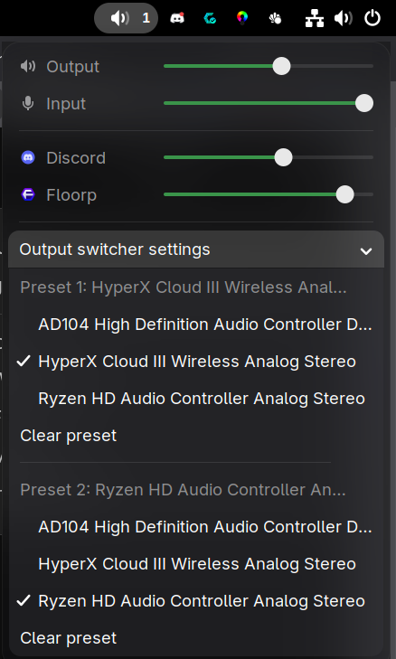

# GNOME Audio Mixer

A compact GNOME Shell panel mixer with per-application volume controls and one-click switching between two audio outputs.

**Stable release: v1.1.0** · GNOME Shell 49–51 · PipeWire / PulseAudio

[Download the latest release](https://github.com/b1naryblaz3/Gnome-Audio-Mixer/releases/latest)



*Output switcher settings expanded for setup. Collapse this section for everyday volume control; right-click the panel icon to switch outputs.*

## Install or update

Download **gnome-audio-mixer-v1.1.0.zip** from the latest release, then run:

```bash
gnome-extensions install --force ./gnome-audio-mixer-v1.1.0.zip
```

**Log out and back in** to load the new code. Enable the extension if needed:

```bash
gnome-extensions enable app-volume-panel-v4@appvol.local
```

Use the ZIP attached to the release, rather than GitHub's automatically generated source archives. It includes the compiled settings schema and requires no extraction or installer script. Existing application volumes and output presets are preserved.

## Everyday controls

| Action | Result |
| --- | --- |
| Left-click the panel icon | Open the mixer |
| Right-click the panel icon | Switch between your two output presets |
| Middle-click the panel icon | Mute or unmute the master output |
| Scroll over the panel icon | Adjust master output volume |
| Drag a volume slider | Adjust the output, microphone or application volume |
| Click a row's audio/application icon | Mute or unmute that row |

The **1 / 2** indicator beside the panel icon shows the active output preset. A dash means neither preset is active or setup is incomplete.

## Set up output switching

1. Left-click the panel icon.
2. Expand **Output switcher settings** at the bottom. It opens automatically until both presets are configured.
3. Choose a device in the **Preset 1** group and a different device in **Preset 2**, such as speakers and a USB headset.
4. Right-click the panel icon to switch between them.

Once both presets are selected, setup collapses so the volume controls take priority. There is no separate “Switch output” row in v1.1.0. You can expand settings whenever you need to change or clear a preset.

Presets survive logout and reboot. Disconnected devices retain their selection and become usable again when they reconnect with the same sink name. Right-click shows a notification if the switch target is unavailable. Selecting a device already assigned to the other preset clears its previous assignment.

If neither preset is active, switching selects preset 1 first. Presets select output devices (sinks), rather than microphone inputs or separate ports on the same sound card. Applications with explicitly pinned audio routing may retain their own routing.

## Features

- Master output, microphone input and per-application volume sliders.
- Multiple streams from one application grouped into one row.
- Remembered application volumes applied to new streams.
- Improved browser, Discord and Electron identification using PipeWire/PulseAudio metadata.
- Two remembered output presets with right-click switching.
- Compact preset setup below the volume controls.
- No continuous polling or live volume meters.

## Compatibility and requirements

Supported GNOME Shell versions: **49, 50 and 51**.

The baseline was tested on GNOME Shell 50.4. The maintainer also tested the output switcher and compact v1.1.0 layout on a live GNOME / CachyOS Wayland system. Not every supported Shell version and audio-device combination has been tested.

The extension reuses GNOME Shell's GVC mixer control. For better application identification, it asynchronously runs:

```bash
pactl -f json list sink-inputs
```

when audio topology changes. If `pactl` is missing or times out, identification falls back to GVC metadata. On Arch/CachyOS, `pactl` is supplied by `libpulse` and works with `pipewire-pulse`.

## Build or install from source

Source installation requires Python 3 and `glib-compile-schemas`, in addition to the normal GNOME audio stack.

```bash
git clone https://github.com/b1naryblaz3/Gnome-Audio-Mixer.git
cd Gnome-Audio-Mixer
bash tools/install.sh
```

Log out and back in after installation. The installer preserves saved volumes and presets.

To build an installable extension ZIP:

```bash
bash tools/package.sh
```

The local package is written to `dist/app-volume-panel-v4@appvol.local.zip`. GitHub releases use the simpler name `gnome-audio-mixer-vX.Y.Z.zip`.

## Development and releases

Develop changes on a branch, test the installable ZIP on GNOME, then merge the approved update into `main`.

For a new stable release:

1. Update `metadata.json` with the new semantic `version-name`.
2. Increase GNOME's separate integer `version` counter.
3. Add a matching version section to `CHANGELOG.md`.
4. Merge after testing.

The release workflow automatically creates the version tag, builds the extension ZIP and publishes it with notes from the changelog. An already completed release is skipped. Documentation-only changes do not trigger a new release. The workflow can also be run manually from GitHub Actions.

Public semantic versions started at 1.0.0; the earlier 4.x/5.x versions were development iterations. Version 1.1.0 uses internal counter **513**.

The extension UUID stays `app-volume-panel-v4@appvol.local` to preserve existing installations and settings.

### Project structure

```text
extension.js        Extension lifecycle and panel registration
audio.js            Stream model, grouping, metadata and persistence
outputs.js          Output preset resolution
ui.js               Panel indicator, volume rows and preset setup
stylesheet.css      Extension styling
metadata.json       GNOME compatibility and version metadata
schemas/            GSettings schema
tools/              Installation and packaging scripts
.github/workflows/  Release automation
```

## Known limitations

- Application identification depends partly on metadata supplied by applications.
- The popup is rebuilt when stream topology changes.
- GNOME 50/51 click handling uses an internal panel gesture field to restrict menu opening to left-click; it needs checking against future GNOME releases.
- Blur My Shell can draw a rectangular blur layer behind rounded popup corners. Adjust or disable popup blur in that extension if you encounter this.

## Troubleshooting

Check recent GNOME Shell errors:

```bash
journalctl --user --since "15 minutes ago" _COMM=gnome-shell -o cat | \
  grep -Ei 'app-volume-panel|JS ERROR|TypeError|ReferenceError|CRITICAL'
```

No matching output means the filter found no matching messages.

Check for leftover metadata helpers while the mixer is idle:

```bash
pgrep -af pactl
```

## Development credits

Vibe-coded collaboratively by [b1naryblaz3](https://github.com/b1naryblaz3) and ChatGPT (OpenAI).

b1naryblaz3 directs the project, chooses the behaviour and tests releases on a real GNOME / CachyOS Wayland system. ChatGPT assists with implementation, debugging, architecture and review.
